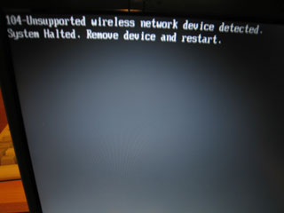
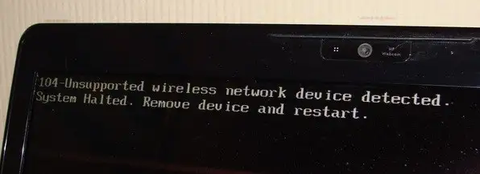
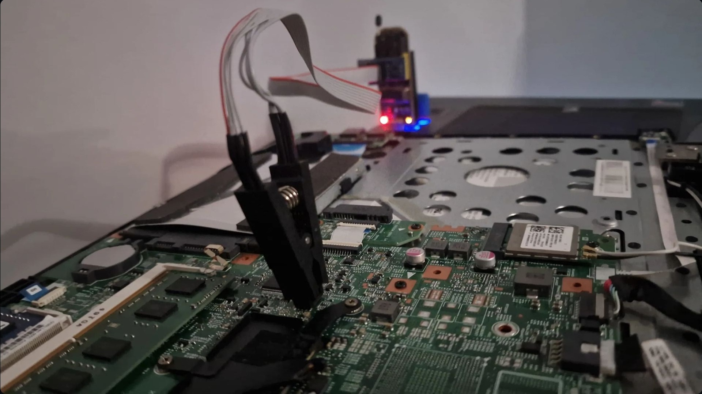
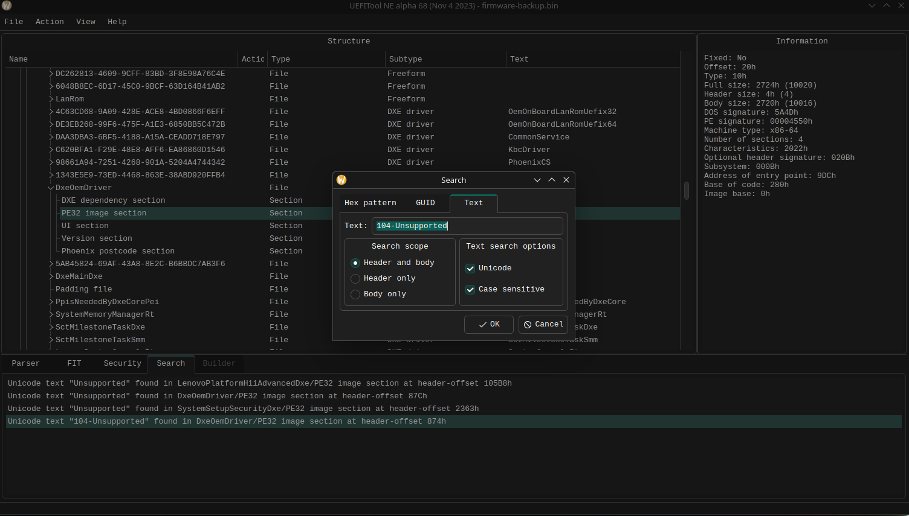
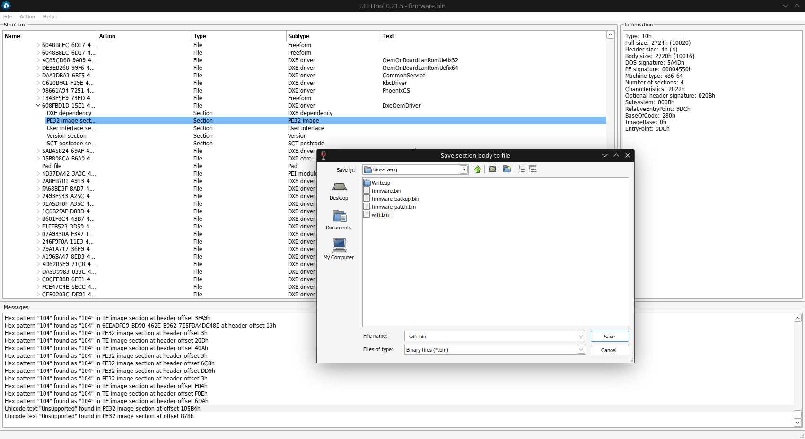
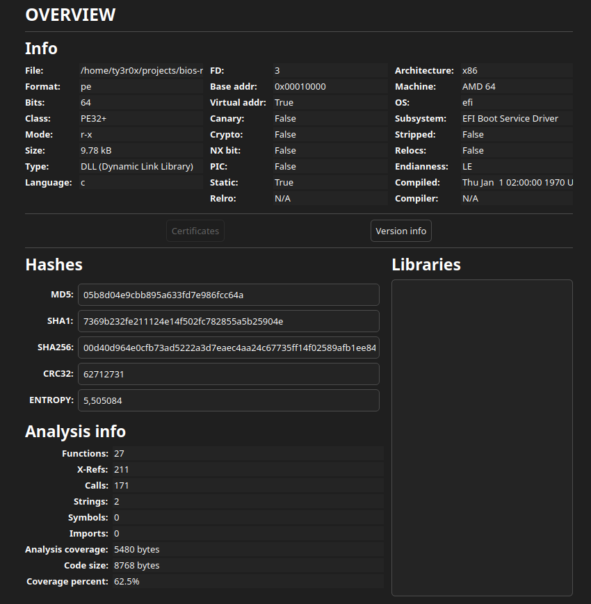
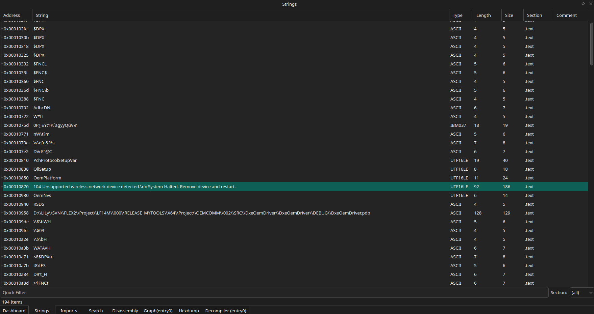
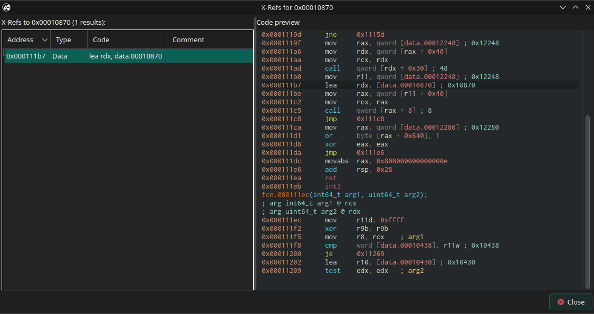
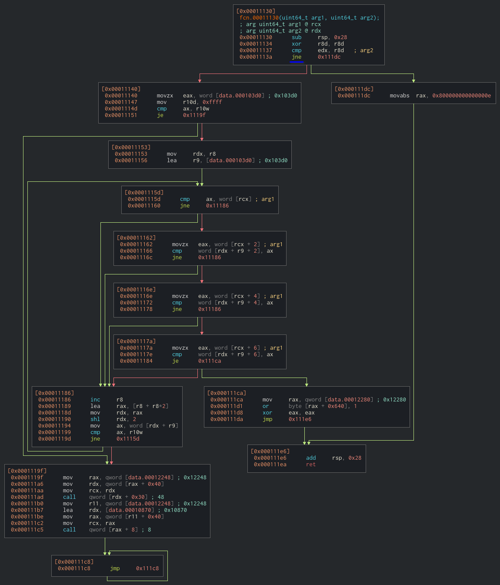
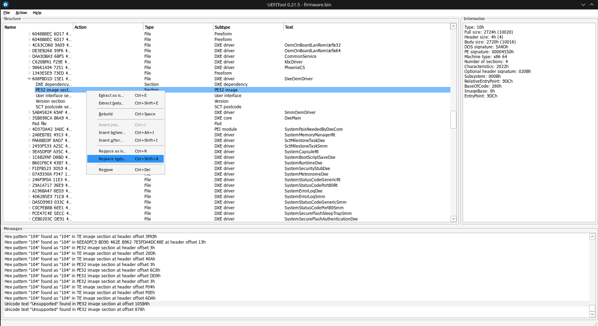

+++
title = "Reverse Engineering Lenovo Flex 2-15 BIOS"
description = "What do you mean I cannot use any Wi-Fi card, fuck off!"
date = 2026-08-24
template = "blog-post.html"

[taxonomies]
tags = ["work", "hacking", "technology"]
+++

Greetings again! Aside from my usual rants about everyone, and everything, I also tinker with technology. This time, despite planning to post this 2 years ago but never had the energy to make a writeup (despite me being a pain in the arse vibecoder I do not want to ai generate a writeup, my brain is not handicapped thank you very much), I present to you my journey of spending hours on cutter and using snazzy hardware just to flip a conditional assembly line and patching it on a BIOS chip (yes it was that simple).

# What we are dealing with

<div class="image-row">




</div>

For those unfamiliar, on some Lenovo laptops (or others using inside h20 BIOS iirc), if you attempt to upgrade its internal wi-fi card with hardware which is not "Endorsed" by Lenovo, the laptop will enter a soft brick, unable to continue with its usual boot procedure. Despite this being blatantly anti-trust and can rant about this all day, fortunately I was still motivated (as a sidenote, an honest fuck you and go dilate to some of you uni professors) and had the know-how to pull this feat off (kudos to [nir lichtman](https://www.youtube.com/channel/UCAMu6Dso0ENoNm3sKpQsy0g) san for bingewatching really cool content).

First of all, there is no public exploit for this laptop model. If I was lucky I could've flashed libreboot or a pre-patched firmware and called it a day. So I had to resort to manually reverse engineering its BIOS machine code and hopefully be able to patch it.

# Teardown and preparing the flasher



Conveniently, only a couple of screws needed to be removed, immediately exposing the important pieces from the motherboard, including the flash chip which holds the BIOS. Despite the community begging us to avoid using CH341A flashers (something to do with injecting 5V in places where it needs 3.3V), and using alternatives such as picoflash or beaglebone, I was impatient and just used what I had nearby. Throughout the process, the chip did not catch fire, the laptop still works as of writing, so for those of you who are in a rush, a CH341A works too. **Make sure to triple check the connection between the chip's pins and the clip and insert the flasher to the USB port AFTER clipping in order to avoid accidentally shortcircuiting**.

# Extracting the firmware blobs

After connecting to the PC, I used `flashrom` to extract the entire chip's contents as a full `.bin` file
```bash
flashrom -p ch341a_spi -r bios.bin
```
but it's too large to be opened in cutter without having a seizure (at the time of attempting, around 2024, cutter was still in early stages), so it was both good practice and benefical to extract just the bit I needed (plus similiar tutorials around the internet also advice doing). I came upon a program named `UEFITool` to extract just the piece I needed to modify. How to find it you may ask, simple!



Just look for the procedure referencing the string `104-Unsupported wireless network device detected.\n System halted. Remove device and restart` and voila! The section is named `DxeOemDriver` fyi, and the place of interest is the PE32 image section. If you ever programmed low level Windows, this may sound familiar, which isn't just a coincidence, we are actually dealing with Microsoft ezoterisms (like looking up UTF-16 characters which will come later), but for now time to extract.



# Patching the procedure



We are now greeted with the part that handles with the locking us up part, but as you can see there are around 27 functions and reveng-ing each one is tedious and foolish! Fortunately, we can repeat the same plan and simply look up the part where it references the error.



I am surprised cutter managed to look up UTF-16 text, initially I tried manually looking up a binary dump and it was very tedious. Nonetheless, I analyzed which procedures referenced this string, and luckily, only one function was responsible for this.




Can you spot the line that's foiling our plans? (I left a hint for you :D). Initially I tried changing the procedure to `jmp` but that made cutter crash each time I tried (probably because the opcode consumes way less bits than a conditional jump), so I simply flipped the bit hoping it'll work (spoiler alert, it does!). This will have the side effect of soft bricking on legitimate whitelisted hardware, but hey, that's a problem for tommorow me, so #wontfix :).

# Putting back together

Now it's time to put the modified part back to the giant `.bin` blob we extracted earlier and patch it back to the laptop's chip. If you looked closely, you probably wondered why I used both native `UEFITool` and the windows version. Strangely, new builds of this tool do not allow us to write changes back to the original flash, however older versions do, and sadly, these are Windows only. 



After that was done, I prepared `flashrom` once again, point of no return:

```bash
flashrom -p ch341a_spi -w bios-modified.bin
```
After opening the laptop, the error was gone and I was able to use it normally! The moral of the story is, if you get fucked by vendors, hack their hardware, it's fun and educational.

---

*Published on: 2026-08-24*
